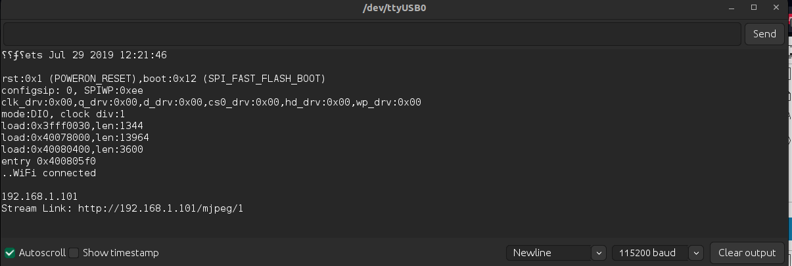

# ESPCAM - Augmented Reality
The following repository provides the integration between an ESPCAM used for video streaming and the implementation of an augmented reality method.
## ESPCAM and Videostream

To use the ESPCAM code, use the scripts in the esp_32_camera_mjpeg folder. Load them into an ESPCAM using the Arduino-IDE.



It is necessary to change the **password** and network in the Arduino script to generate the data port through which the stream will pass. After changing the password and **username** in the fields specified in the script, the serial monitor will display an **IP address** that will be used to capture the image of an ARUCO, found in the DATA folder and will display the 3d model of a fox using its coordinates.
For augmented reality scripts, see the steps below. It is important to change the IP address for the generated adress in the arduino serial plotter in the main augmented reality scripts stream.py or ar_with_tracking.py.

The video stream has based in this repo:
https://github.com/ashus3868/ESP32-CAM-LIVE-STREAMING/tree/main

After this steps you can follow the steps bellow.

## Augumented Reality

"ar.py" is a python program that uses OpenCV to render .obj files on Aruco markers. For an in-depth explanation, check out this [blog tutorial](https://medium.com/swlh/augmented-reality-diy-3fc138274561).

<!--  -->

<p align = "center">
  
</p>


## Dependencies

It uses OpenCV(3.4.2) and Numpy(1.17.2). The python version is 3.7.5

Before installing the dependencies, it is recommended to create a virual environment to prevent confilcts with the existing environment. Using conda, 

```bash
conda create -n augmented_reality python=3.7.5
conda activate augmented_reality
``` 

To install the dependencies - 
```bash
pip install -r requirements.txt
```

## Usage
For the main program - 

```bash
python ar.py
```
It is recommended to print the aruco marker(data/m1.pdf) on a piece of paper. Alternatively, the program should work (but inferiorly) with the marker open on your phone. The white margin around the marker boundary is required for boundary detection. Keeping the marker flat (for example, by sticking it to a piece of cardboard) further helps in detecting the marker. 

For a faster version which uses the Lucas-Kanade method for tracking - 
```bash
python ar_with_tracking.py
```

(Optional) For camera calibration alter the path mentioned in the file and run - 

```bash
python camera_calib.py 
```

Refer to the blog for all the details about camera calibration. 

